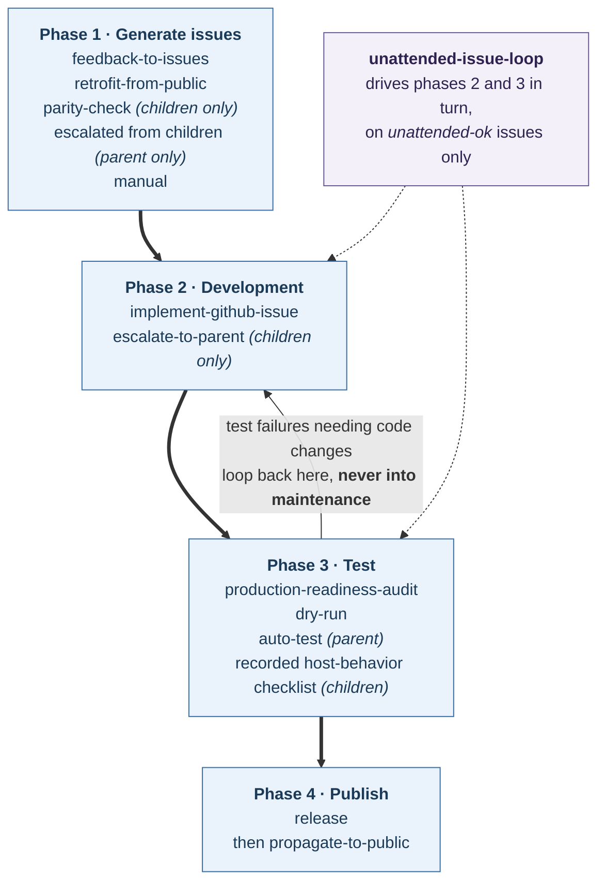
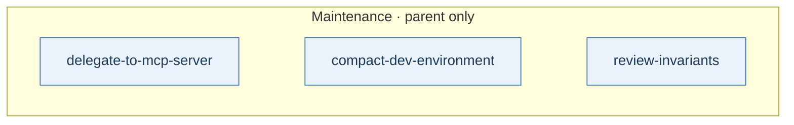
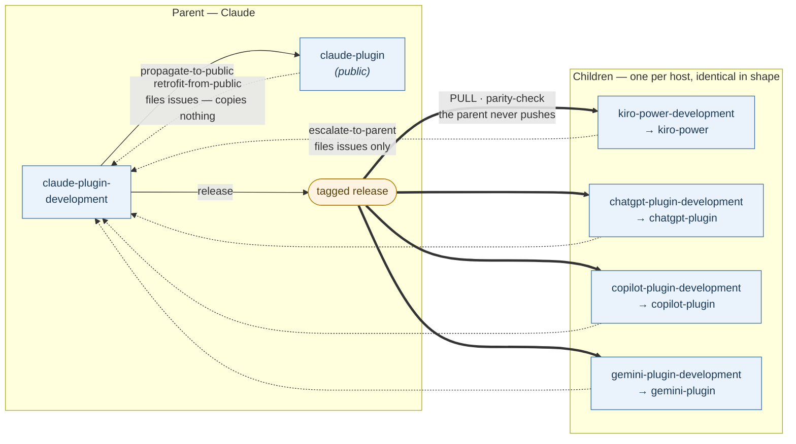
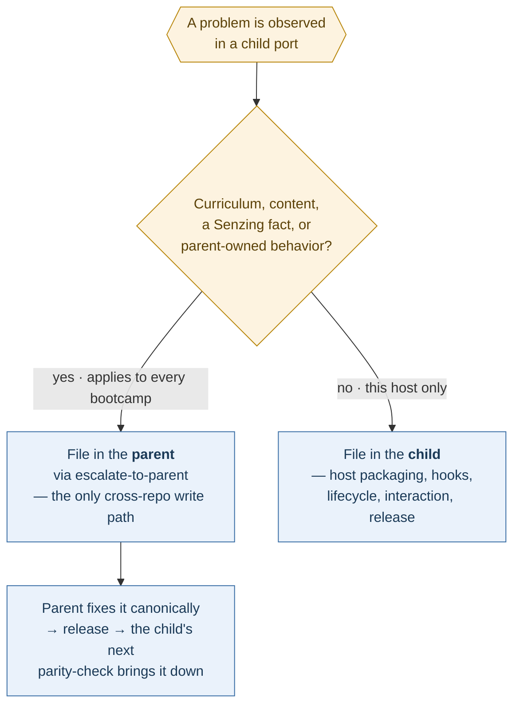

# The Senzing Bootcamp family — development workflow

**Status:** normative. **Adopted:** 2026-09-22. **Amendments:** see [§10](#10-amendments).
**Home:** `docs/FAMILY_WORKFLOW.md` in
`docktermj/senzing-bootcamp-claude-plugin-development` (the parent). Every child development
repository links to this page rather than restating it — a rule with two homes is a rule that
will disagree with itself.

The goal this document serves: **a Senzing Bootcamp behaves the same way for a bootcamper on
Claude, Kiro, ChatGPT, Copilot and Gemini.** Every rule below exists because it keeps those
five experiences from drifting apart.

Rules are numbered `R1`…`R12` so an issue can cite one.

---

## 1. Repositories and roles

| Role | Repository | Owns |
|---|---|---|
| **Parent — development** | `docktermj/senzing-bootcamp-claude-plugin-development` | The curriculum, the bootcamper experience, and the `INV-NNN` invariant namespace |
| Parent — public | `Senzing/senzing-bootcamp-claude-plugin` | Nothing. A mirror bootcampers install from |
| **Child — development** | `docktermj/senzing-bootcamp-kiro-power-development` | The Claude → Kiro transformation and `KINV-NNN` |
| | `docktermj/senzing-bootcamp-chatgpt-plugin-development` | The Claude → Codex transformation and `CINV-NNN` |
| | `docktermj/senzing-bootcamp-copilot-plugin-development` | The Claude → Copilot transformation and `CPINV-NNN` |
| | `docktermj/senzing-bootcamp-gemini-plugin-development` | The Claude → Gemini transformation and `GINV-NNN` |
| Child — public | `Senzing/senzing-bootcamp-{kiro-power,chatgpt-plugin,copilot-plugin,gemini-plugin}` | Nothing. Mirrors |

**R1 — The parent owns the curriculum; children transform, never fork.** A child never copies
or renumbers an `INV-NNN`. Bootcamp content and outcomes are decided in exactly one place.

**R2 — Propagation is a pull, and it starts at a tag.** The parent never pushes into a child
and never files an issue into one. A child takes a **tagged release**, never `main` or `HEAD`.
A version that was never tagged is invisible to the whole mechanism: *a port cannot target a
release that was never tagged.*

**R3 — Public repositories have minimal knowledge of their development repositories.** Every
maintainer command lives in a development repository. A public repository holds only what a
bootcamper installs. This is deliberate and is not an oversight to be corrected.

---

## 2. Canonical operations

**R4 — The canonical operation names are reserved family-wide, and every development
repository exposes each applicable operation under its canonical name.** The *name* is the
invariant; the *invocation mechanism* is the host's business. A Claude slash command, a Kiro
power skill triggered by natural language, and a Codex `commands/` entry are all conforming
implementations of `parity-check` — an operation named `publish-bootcamp-power` is not.

**An operation with no parent counterpart keeps a host-specific name and must not shadow a
canonical one.** Kiro's `create-bootcamp-power` and `update-bootcamp-power` are transformation
mechanisms, not maintainer-facing phases; they keep their names.

| Canonical operation | Phase | Parent | Children | Boundary |
|---|---|---|---|---|
| `feedback-to-issues` | 1 | required | required | In a child, routes each item parent-bound or local (R6) |
| `retrofit-from-public` | 1 | required | required | Files issues. **Writes nothing into any working tree** |
| `parity-check` | 1 | — | required | Reads a parent **tag**. Never writes to the parent |
| `implement-github-issue` | 2 | required | required | Never merges. In a child, advances `PARENT_VERSION` on a parity close |
| `escalate-to-parent` | 2 | — | required | **The only command in a child that writes outside its own repository** |
| `production-readiness-audit` | 3 | required | required | Consistency, coherency, completeness |
| `dry-run` | 3 | required | required | Runtime review |
| `auto-test` | 3 | required | *not mandated* | Probes the live Senzing MCP server for drift |
| `release` | 4 | required | required | **Development repository only** (R8) |
| `propagate-to-public` | 4 | required | required | **Public working tree only** (R8) |
| `unattended-issue-loop` | drives 2–3 | required | *not mandated* | `unattended-ok`-labeled issues only |
| `delegate-to-mcp-server` | maintenance | required | — | Parent only |
| `compact-dev-environment` | maintenance | required | — | Parent only |
| `review-invariants` | maintenance | required | *open question* | See §8 |

⚠️ **Renaming is not free.** Where a child's engine, contract, tests or docs reference an
operation by its old name, the rename is the whole change — a new file beside the old one
leaves two operations where the family expects one.

---

## 3. The per-change flow



The four phases run in order and **only one edge goes backwards**: a test failure needing a
code change returns to development, never to maintenance. Maintenance is where you go when
nothing is failing.

Phases 2, 3 and 4 are identical in the parent and in the children. **Phase 1 is where they
differ**, because it is where work originates: a child additionally runs `parity-check` to pick
up what the parent released; the parent additionally receives what children escalate.

### Maintenance — a separate track, on its own cadence, parent only



Nothing in the four phases waits on these and they wait on nothing. An "optional" per-change
step gets skipped every time, and a step skipped every time never runs at all; giving these
their own cadence is what stops them becoming ceremony.

---

## 4. Repository topology



- **Solid arrows move files. Dotted arrows move only issues.**
- **The topology is one level deep.** Nothing ports from a child. A change that reached two
  children reached each from the parent, never from each other.
- Each child's public repository is its own leaf with the same `release` →
  `propagate-to-public` → `retrofit-from-public` triangle drawn inside the parent box.

---

## 5. Issue ownership

**R5 — The "spec" mechanism is deprecated family-wide. Work is tracked as GitHub issues.**
No development repository generates spec files for new work.

**R6 — The repository that owns the defect owns the issue.**



`feedback-to-issues` and `retrofit-from-public` run this decision **per item** in a child and
must show the verdict for each. In the parent there is nothing to decide — every issue is
local.

**R7 — Escalation closes on arrival, not on the parent's close.** An escalated issue carries a
cross-reference in both directions. The child's local tracking issue closes when a
`parity-check` against a parent tag **containing** the fix confirms it arrived. A parent issue
closed but not yet released has not reached any bootcamper.

**R8 — `implement-github-issue` never chooses its own target.** Invoked with no argument, it
asks which issue and stops until answered. It does not recommend and it does not pick. The
command pushes branches and opens pull requests; selecting its own work is the one autonomy it
is designed not to have.

---

## 6. Release and publication boundaries

**R9 — `release` touches only the development repository.** It bumps the version everywhere it
is asserted, writes the CHANGELOG entry, commits, and creates the git tag — as one operation,
with no path that moves one without the others. It does not touch the public repository.

**R10 — `propagate-to-public` touches only the public repository's working tree.** It mirrors
what a bootcamper needs, rewrites development self-references to the public slug, and **stops
there: no commit, no push, no branch, no pull request, no release.** The maintainer reviews the
diff and publishes by hand, and a versioned release in a public repository is created only
after that version has been tested.

⚠️ **This is the boundary most easily eroded**, because "just open the PR too" looks like
convenience. It is not: the diff a maintainer reviews before anything leaves the machine is the
last gate before a bootcamper sees the change.

---

## 7. Invariants

**R11 — Each development repository maintains `specs/INVARIANTS.md`, and every child
additionally maintains an inherited-invariant disposition register.**

| | Parent | Child |
|---|---|---|
| Own namespace | `INV-NNN` in `specs/INVARIANTS.md` | `KINV` / `CINV` / `CPINV` / `GINV`-`NNN` in `specs/INVARIANTS.md` — guarantees true of the *host port itself*, with no upstream source |
| Inherited register | — | **Required.** Every upstream `INV-NNN` recorded as *honored* / *preserved-restated* / *discounted*, a discount carrying a mandatory conflict and resolution |
| Evaluated when | Every change | **Both registers, on every propagation of a newer parent release** (dual-evaluation) |

A host-native invariant MUST NOT restate an upstream `INV-NNN` or a disposition-register entry.
Where it names an upstream invariant it does so only to locate the parity gap it is about.

A host-native prefix is registered in this table so two children cannot collide. A failed
invariant on either side is a **release blocker**, not advisory documentation.

**R12 — Succession has exactly one syntax, in every invariant file in the family.** Both lines
are required; each is a bullet of its own, and the identifier is zero-padded to three digits:

```markdown
- **Superseded by:** INV-312 — the guard moved from the hook to the contract
- **Supersedes:** INV-208
```

Nothing else establishes supersession — not prose, not a status word, not a strikethrough. An
invariant carrying `Superseded by:` has status `superseded`; one that does not has status
`active`; and **there is no third state.** This exists because the parent's generated manifest
reports `status: unclear` for a substantial minority of its invariants, the prose having
written supersession six different ways. ⚠️ **No count is stated here deliberately**: a
figure in normative prose goes stale silently while reading authoritative, and four
repositories cite this rule. Read the live number off `invariant-manifest.json`.

### Provenance: one name

**The pinned parent release is `PARENT_VERSION` (an exact SemVer tag) and `PARENT_COMMIT` (the
full SHA), in every child.** Not `UPSTREAM_VERSION`. "Upstream" is already taken in this family
— the Senzing MCP server is upstream of every repository here, and a feedback item routed
"upstream" goes to Senzing, not to the parent. The parent/child vocabulary is the one the
topology uses, so the provenance names follow it.

Where a child stores those values is the host's business — a manifest extension block and a
pair of files are both conforming — but the *names* are fixed, and a child reads them from one
place.

---

## 8. `specs/` is frozen, with four live exceptions

The parent froze `specs/` on 2026-09-15 (INV-307). ⛔ **The archive is read-only; no new spec
files are written by any command.** Four files in it are **not** frozen and are still written
to:

- `specs/INVARIANTS.md` — the invariant register
- `specs/IMPLEMENTED.md` — the implementation ledger, including `DEFERRED INVARIANT` blocks
- `specs/DECLINED.md` — decisions *not* to build, with a required reason and revisit condition
- `specs/README.md` — the freeze notice itself

⚠️ **"`specs/` is no longer used except for `INVARIANTS.md`" is the wrong reading** and would
delete the implementation ledger and the record of declined decisions. The archive is retained
deliberately: it is where the reasoning behind shipped behavior lives.

**Open question, deliberately not decided here:** children now maintain two invariant registers
and therefore have the same deferred-invariant problem the parent solved with
`review-invariants`. Whether that operation is ported down is unresolved; until it is, a child's
dual-evaluation gate at update time is the only thing standing in for it.

---

## 9. Bootstrapping a new child

A new child reuses **unchanged**: the transformation engine, the disposition-register shape,
reconciliation, and the governance operations. It supplies **only** three host-specific things:
its own invariant prefix and register, its substitution sets and host mechanisms in the
contract, and its host-behavior checks. The parent, and the `INV-NNN` it owns, do not change.

The nine components every child provides:

| | Component | Release gate |
|---|---|---|
| A | Tagged provenance (`PARENT_VERSION`, `PARENT_COMMIT`) | A stable parent tag and full commit only; never `HEAD` |
| B | Declarative transformation contract | Every upstream file matched exactly once, or fail |
| C | Inherited-invariant disposition register | Every `INV-NNN` honored, preserved-restated, or justified as discounted |
| D | Host-native invariant namespace | Both registers evaluated on every update |
| E | Mechanical port checks | Provenance, files, residual host references, static hook behavior |
| F | Three-way reconciliation | A pre-write report naming added, modified, removed, preserved and conflicting paths |
| G | Recorded host-behavior test checklist | Every critical manual result recorded per release |
| H | CI determinism gate | A rebuild at the pinned tag leaves no diff |
| I | Cross-repo governance | `parity-check` pulls down; `escalate-to-parent` is the sole upward write path |

Where a host lacks a mechanism the parent relies on, **preserve the guarantee with a
host-native construction where possible; otherwise document the advisory degradation** in the
disposition register and the release evidence. Never drop it silently.


---

## 10. Amendments

⛔ **A numbered rule that changes meaning is recorded here, with the wording it replaced.**
Four repositories cite these rules by number, and their conformance issues are written against
whatever the page said on the day they were opened. A reader holding an earlier copy has no
other way to discover that a rule moved: the parent never files into a child (R2), so this
section **is** the notification channel, and it travels by parity like everything else.

⚠️ **Not every edit is an amendment.** A typo, a link, a clearer example: not recorded. The
unit here is a change to what a numbered rule *requires*, because that is the unit another
repository cites.

⚠️ **An amendment does not renumber.** R8 stays R8. A rule that is withdrawn keeps its number
and says so, for the same reason `INVARIANTS.md` never reuses an id: a citation that silently
resolves to a different rule is worse than one that fails.

### 2026-09-22 — R8 widened, and the parent brought into line

**Recorded as a restatement; it was not one.** #111's notes described R8 as restating the
existing guardrail in the parent's `implement-github-issue` command. That command said:

> If `$ARGUMENTS` is **empty**, ask which issue and stop until answered. Do not choose one.

R8 adds **"It does not recommend and it does not pick."** *Do not choose* and *do not
recommend* are different rules — ranking the open issues, or marking one *(Recommended)*, is
choosing with extra steps, and the guardrail as written permitted it.

**Resolution:** R8 stands as written and the **parent command was brought up to it**, so the
rule has one home (INV-300). R8's text is unchanged from adoption; what changed is that it is
now an accurate statement of what the parent does.

⚠️ **A child implementing `implement-github-issue` from the adopted text was already correct.**
The divergence was in the parent, and in the note claiming the two agreed.

### 2026-09-22 — R12's count removed

**Was:** *"…the parent's generated manifest currently reports `status: unclear` for 33 of 309
invariants, the prose having written supersession six different ways."*

**Now:** the same evidence with **no denominator**.

`33` was correct; `309` was already stale on the day of adoption — the manifest held **311**,
INV-311 and INV-312 having been registered that morning. ⛔ **The figure was removed rather than
corrected**, because correcting it only resets the clock: the parent's own suite fails a count
of commands stated in prose in `docs/development.md`, on the ground that *a number goes stale
silently while reading authoritative*. A normative page four repositories cite is the worst
place for one.

**For a child:** a conformance issue citing R12's count is not wrong about the rule. R12's
requirement — one syntax for succession, both lines, zero-padded — is unchanged. Only the
supporting figure was dropped.
