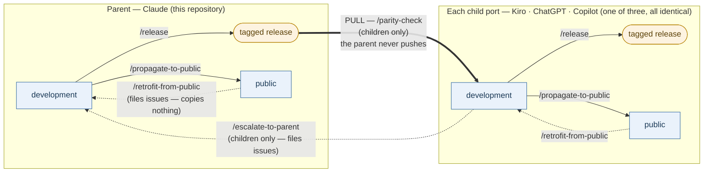
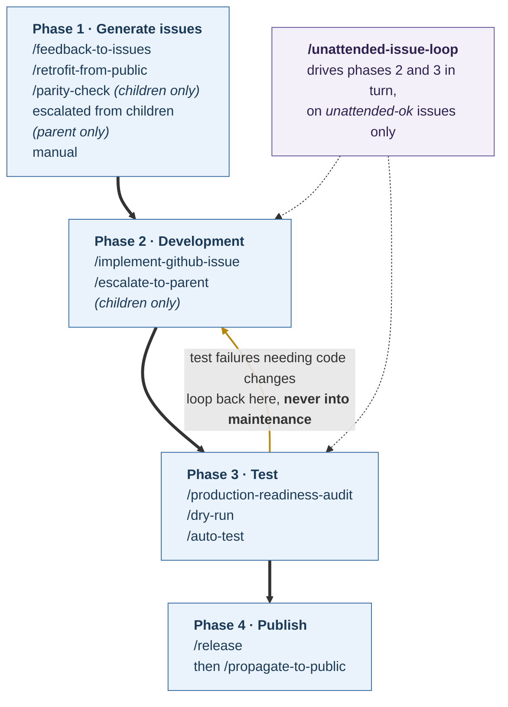
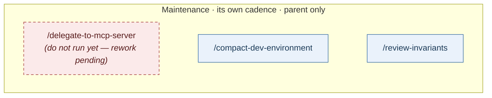

# Senzing Bootcamp Claude Plugin Development

## Setup

Install the development dependencies before running the test suite:

```console
python3 -m pip install -r requirements-dev.txt
```

Run everything:

```console
python3 -m unittest discover -s tests
```

`pytest -q` also works and prints a shorter summary; it is not required.

### Why the install step matters

The only dependency is `fpdf2`, and it is **not** a runtime requirement of the plugin. The
shipped PDF generators tier their renderers — `fpdf2` when importable, a stdlib fallback
otherwise — so a bootcamper without it still gets a PDF, and that fallback path ships and is
tested.

Without `fpdf2` the tests that measure the *fpdf2-rendered* output cannot exercise it. They
skip, and the suite prints one notice up front naming the cause:

```text
fpdf2 is not installed for /usr/bin/python3

The tests that measure the fpdf2-rendered PDF will be SKIPPED. They are not
failing: the stdlib fallback renderer lays out pages differently, so their
assertions do not describe it. The fallback's own tests still run.
```

⚠️ **A green run without `fpdf2` is a weaker signal than a green run with it** — the fpdf2
renderer goes unmeasured. Install it before trusting a run, and always before a release.
Set `SBCP_QUIET_FPDF2_NOTICE=1` to suppress the notice for tooling that parses test output.

CI runs the suite **both ways** on every pull request
(`.github/workflows/test-suite.yaml`, a matrix over `fpdf2: [present, absent]`), so neither
path can rot unnoticed. The `absent` job is the one that catches a new fpdf2-dependent test
landing without a `@requires_fpdf2` guard — an omission that is invisible locally to anyone
who has `fpdf2` installed.

Before this was wired up (#30), those tests did not skip — they ran against the fallback and
failed as 41 assertions about certificate names, grid alignment and label wrapping, only 6 of
which named the missing package anywhere in their traceback. The suite read as 41 product
defects when the only defect was an unstated prerequisite.

## Conventions

### Spelling: US English, not British English

**US English is the preferred spelling throughout this repository** — shipped
plugin prose, specs, invariants, tests, code comments, and identifiers alike.
Prefer `-ize`/`-yze` over `-ise`/`-yse`, `-or` over `-our`, `-er` over `-re`,
`license` over `licence`, and a single `l` before a suffix (`labeled`,
`modeled`, `traveled`).

| British (avoid) | US (use)     | British (avoid) | US (use)     |
| --------------- | ------------ | --------------- | ------------ |
| analysed        | analyzed     | judgement       | judgment     |
| artefact        | artifact     | labelled        | labeled      |
| behaviour       | behavior     | licence         | license      |
| catalogue       | catalog      | millimetre      | millimeter   |
| centre          | center       | normalise       | normalize    |
| colour          | color        | organisation    | organization |
| defence         | defense      | recognise       | recognize    |
| favour          | favor        | sanitise        | sanitize     |
| honoured        | honored      | summarise       | summarize    |

Two deliberate exceptions, both verified rather than assumed:

- `plugins/senzing-bootcamp/scripts/vendor/d3.v7.min.js` — a vendored
  third-party bundle whose `grey` is a CSS color-name key, not prose.
- `D:\Programme` in `tests/test_windows_browser_discovery.py` (and where
  `specs/IMPLEMENTED.md` records it) — a *German* localized `%ProgramFiles%`
  fixture proving environment expansion. It is not English.

`SCOPE_VERBS` in `.claude/skills/compact-dev-environment/widened_scope.py`
deliberately carries both `"generalis"` and `"generaliz"` so the scanner stays
tolerant of either spelling in text it reads.

This is **INV-253**, enforced by `tests/test_us_english_spelling.py`, which scans
the whole tree and matches whole words after splitting identifiers on both `_`
and CamelCase boundaries — so `test_the_..._limit` and `NoStep...Changed` are
caught as readily as prose.

⚠️ **A clean run does not mean the corpus is US English.** The guard's word list
is hardcoded and cannot be otherwise: the corpus is the thing being judged, so
there is nothing to derive the vocabulary from. A clean run means no *listed*
form is present. Two consequences worth knowing before you rely on it:

- `analyses` is deliberately absent, because it is both the British verb and the
  correct US plural of `analysis`. Those seven occurrences were converted by
  hand and would not be caught coming back.
- Stem matching is rejected: `organism`, `mechanism`, `parallelism`,
  `characteristic`, `equally`, `totally`, `radialLine` and
  `LabelLayoutAssertions` are all correct and all contain British-looking stems.

A file that must carry a British form is waived by **path plus the exact word and
count**, never as a whole file, so every other British form in it still fails and
a waiver whose word has gone fails as stale. There is no marker you can add to a
line to silence the guard — that is deliberate, or it becomes the way every
future British spelling gets waved through.

## What downstream ports may rely on

The Kiro and Codex ports (and those that follow) read this repository as their parent. ⛔ **They
must never copy or renumber an `INV-NNN`** — the ids are authoritative here and a child that
renumbers cannot be checked against anything.

What the parent undertakes to provide:

- **`invariant-manifest.json` at the repository root** — every invariant with its `id`,
  `index_group`, `section`, `status`, `statement`, and a `summary` where one could be derived.
  ⛔ **(INV-311)** Generated from `specs/INVARIANTS.md`, which stays the source of truth, and
  checked in CI so it cannot drift (`tests/test_invariant_manifest_matches_the_prose.py`). Regenerate with
  `python3 .claude/skills/review-invariants/invariant_manifest.py`; `--check` exits 1 when stale.
- **A diffable shape.** Sorted keys, one entry per id, so two releases' manifests can be compared
  to see what was added, edited or superseded — which is what a child's dual-evaluation needs.
- ⚠️ **Honest nulls.** `summary` is `null` where no one-line statement could be extracted — 113 of
  309 at time of writing — and ⛔ **that means *not derivable*, never *no rule***. `statement`
  always carries the full text. A child treating null as absence will under-count its register.
- ⚠️ **`status` is `unclear` where the prose is ambiguous** (33 at time of writing), never guessed.
  The prose writes supersession six different ways, and the same word marks an entry that
  supersedes another as well as one that was superseded.
- **`/review-invariants` keeps it current**: registering an invariant regenerates the manifest.

⚠️ **Not undertaken:** that a `summary` exists for every id, or that `status` is decidable for
every id. Both are properties of the prose, and the manifest reports them rather than repairing
them (#88).

## How the pieces fit together

Three views of one system: which repositories exist and how change moves between them, what
happens to a single change, and what runs on nobody's schedule but its own. The command index
below this section says what each command *is*; these say **when** you reach for it.

⛔ **Every command drawn below either ships here or is marked as a child's.**
A command that ships has a file in `.claude/commands/`; one that does not is marked
*(children only)* at the node naming it. Two are marked: `/parity-check` and
`/escalate-to-parent` belong to the child ports, and a drawing of the four-repository system
that left them out would be wrong. `tests/test_the_flow_diagram_names_real_commands.py` holds
this both ways round — a node naming a command that neither ships here nor carries the marker
fails the suite, and so does a marker placed on a command that *does* ship here.

⚠️ **INV-302's guard cannot see these diagrams.** It parses the numbered ``1. `/name` `` list
shape only, so a phantom command inside a fenced block was invisible to it until this guard
landed.

### Repository topology



**Propagation is a pull, and it starts at a tag.** The parent never pushes into a child and
never files into one; a child takes what it takes, when it takes it. What it takes is a
**tagged release** — the downstream ports port from a tag rather than from `HEAD`, which is
why `/release` exists as its own operation and why an untagged version is invisible to the
whole mechanism: *a port cannot target a release that was never tagged.*

Three further things the drawing is being careful about:

- **`/propagate-to-public` runs from the working tree, not from the tag.** The two edges out
  of `development` are siblings, not a chain. The tag is what children read; the mirror is
  what bootcampers install.
- ⛔ **(INV-312) The dotted edges carry issues, not content.** `/retrofit-from-public` and
  `/escalate-to-parent` file in their own tracker and write nothing into any working tree.
  A solid arrow moves files; a dotted one moves only a report that something moved.
- **The children are leaves.** A child's tagged release is drawn because a child does release,
  but nothing ports *from* it — the topology is one level deep, and a change reaching two
  children reached them from here twice, never from each other.

⚠️ **`docs/development.md` is the one file in `docs/` that does not propagate**
(`propagate.sh` excludes exactly `/development.md`, after a 2026-08-16 incident in which
"`docs/` is user-facing" was stated as a convention and acted on as a rule). So this page
reaches the children the way everything else does — by parity — and reaches the public
repositories not at all.

### The per-change flow



The four phases run in order, and only one edge goes backwards. ⚠️ **A test failure that
needs a code change returns to development, never to maintenance** — that is the loop the
gold arrow draws, and the distinction is the point of drawing it: maintenance is where you
go when nothing is failing.

`/unattended-issue-loop` is drawn beside the flow rather than inside it because it is not a
phase — it **drives** phases 2 and 3 in turn, on `unattended-ok` issues only, and an issue
carrying no label is not work it may take. ⚠️ **The issue text for this diagram did not list
it**; it is drawn because a reader looking for every command would otherwise conclude it sits
outside the flow, which is the opposite of true.

Phases 2, 3 and 4 are identical in the parent and in the children. Phase 1 is where they
differ, because it is where work *originates*: a child additionally reaches for
`/parity-check` to pick up what the parent released, and the parent additionally receives
what children escalate. Children run `/escalate-to-parent` after development, which is why it
sits inside phase 2 rather than beside it.

### Maintenance



**A separate track, on its own cadence, in the parent only.** Nothing in the four phases
waits on these commands and they wait on nothing — which is deliberate rather than an
oversight in the drawing. An "optional" per-change step gets skipped every time, and a step
that is skipped every time never runs at all; giving these their own cadence is what stops
them becoming ceremony attached to a flow that would rather skip them.

⚠️ **`/delegate-to-mcp-server` is drawn in red because it should not be run yet** — it still
writes spec files, which the freeze guard rejects, as the note below this section records.

## Claude development skills

⛔ **(INV-302) This list and `.claude/commands/` must agree in both directions, and every
skill must be fronted by a command.** A documented command that does not ship tells you to
run something that does not exist; one that ships undocumented is undiscoverable. Every
entry carries a description. Do not state how many there are — the set is derived and
compared, and a count in prose goes stale silently while reading authoritative.

⛔ **(INV-307) `specs/` is frozen as of the 2026-09-15 cutover; new work is tracked as
GitHub issues.** See [`specs/README.md`](../specs/README.md). ⛔ **One command below still writes
spec files — `/delegate-to-mcp-server`** — so its output is rejected by the freeze guard and it
should not be run until its rework lands; it has no issue yet. Every other command that used to
write there has been reworked: `/feedback-to-issues` files GitHub issues (#49), `/implement-spec`
was retired (#50, #60), `/unattended-issue-loop` is renamed and label-gated and now forbids
writing into the archive outright (#51, #69), and `/production-readiness-audit` files issues when
attended and records findings in the ledger when not (#69). `IMPLEMENTED.md`, `DECLINED.md`,
`INVARIANTS.md` and `README.md` are **not** frozen and are still written to.

### Triage feedback

1. `/feedback-to-issues` - File GitHub issues from SENZING_BOOTCAMP_PLUGIN_FEEDBACK.md files.

### Development loop

1. `/implement-github-issue` - Take a GitHub issue to pull-request-open on its own branch.
1. `/review-invariants` - Decide the deferred invariants awaiting sign-off.
1. `/delegate-to-mcp-server` - Determine if there are instructions that are in the MCP server
1. `/compact-dev-environment` - Try to compact the plugin.
1. `/production-readiness-audit` - Do a thorough static review.
1. `/dry-run` - Do a thorough runtime review.
1. `/unattended-issue-loop` - Work the `unattended-ok` issues unattended, alternating implement and audit.

### Publish

1. `/auto-test` - Probe the live MCP server for drift; optionally walk the bootcamp.
1. `/retrofit-from-public` - Bring public-repo edits back into development.
1. `/release` - Bump the version, write the CHANGELOG entry and create the git tag as one unit.
1. `/propagate-to-public` - Mirror the shippable plugin into the public access repo.
